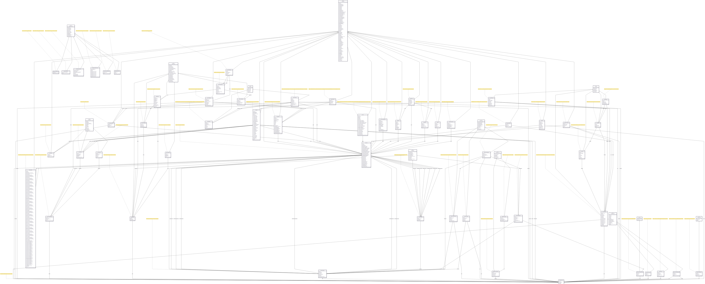

# Star Atlas Programs Map

> A comprehensive diagram of the main on-chain programs that power **Star Atlas SAGE** 🚀

## Table of Contents

- [Star Atlas Programs Map](#star-atlas-programs-map)
  - [Table of Contents](#table-of-contents)
  - [Overview](#overview)
  - [Goal](#goal)
  - [The Map](#the-map)
  - [Getting Started](#getting-started)
    - [Prerequisites](#prerequisites)
    - [Understanding the Diagram](#understanding-the-diagram)
  - [Contributing](#contributing)
  - [Reporting Issues](#reporting-issues)
  - [License](#license)

## Overview

This repository provides a comprehensive diagram of the main on-chain programs (not all) that power Star Atlas SAGE. Whether you're a developer, builder, or simply curious about the technical architecture of Star Atlas, this project offers an accessible way to understand the complex program relationships.

## Goal

The goal of this project is to help developers, builders, and the wider Star Atlas community understand the intricate architecture of SAGE. By visualizing the programs and their relationships, we aim to provide a clear and accessible resource for anyone interested in the technical workings of the game. The diagram is AI friendly, so you can have conversations with an LLM about it.

## The Map

The core of this project is the **Mermaid diagram**, which visually represents the definitions and relations between all Star Atlas SAGE programs.

The diagram is generated from the [`star-atlas-programs.mmd`](./star-atlas-programs.mmd) file. You can view and edit this file using any Mermaid-compatible editor or by using online tools like the [Mermaid Live Editor](https://mermaid.live).

## Getting Started

### Prerequisites

- A Mermaid-compatible editor or viewer
- Basic understanding of blockchain programs (optional but helpful)

### Understanding the Diagram

- **Nodes**: Represent individual programs or accounts
- **Arrows**: Show relationships and dependencies

## Contributing

This project is open to contributions! We welcome:

- **Bug fixes** and accuracy improvements
- **New program additions** as the game evolves
- **Documentation improvements**
- **Visual enhancements** to the diagram
- **Feature requests** and suggestions

## Reporting Issues

This map is a community effort and may contain errors. If you find any issues, discrepancies, or have suggestions for improvement, please open a new issue and include specific details about what you found.

Your feedback is crucial in maintaining the realiability, accuracy and quality of this resource!

## License

This project is licensed under the [MPL 2.0 License](./LICENSE) - see the [LICENSE](./LICENSE) file for details.
